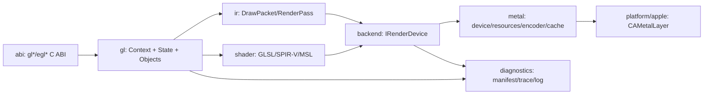

# 系统架构文档

## 文档信息
- **功能名称**：Direct Metal OpenGL 3.3 Core 全量重构
- **版本**：1.0
- **创建日期**：2026-08-12
- **作者**：Architect Agent

## 摘要

> 本文是下游开发、评审、QA 和 DevOps 的架构基线。运行时、公共后端契约、状态模型、构建和 CI 均彻底移除 Vulkan/MoltenVK；对外保留宿主需要的 OpenGL 3.3 Core/EGL ABI，对内直接使用 Metal 2+。

- **架构模式**：单体动态库，内部严格分层（ABI / GL 语义 / Render IR / Shader / Metal 后端 / Apple 平台 / 诊断）。
- **技术栈**：C++20、Metal.framework、QuartzCore、Foundation、UIKit/AppKit；`glslang` 解析 GLSL 3.30 并生成 SPIR-V，SPIRV-Cross MSL backend 生成 MSL/反射；不链接或加载 Vulkan runtime。
- **核心决策**：新 `IRenderDevice` 领域接口不含 `Vk*`/`id<MTL*>`；`Context`、`ShareGroup`、`DeviceSession` 分离所有权；GL draw 先归一化为不可变 Render IR，再由 Metal encoder 编码。
- **主要风险**：GLSL/MSL 长尾语义、A11 Metal 2 能力和内存压力、Minecraft/LWJGL 隐含 ABI、drawable 生命周期；通过 shader corpus、trace replay、离屏 golden 和 iPhone X 真机门禁控制。
- **项目结构**：`src/abi`、`src/gl`、`src/ir`、`src/shader`、`src/backend`、`src/metal`、`src/platform/apple`、`src/diagnostics`、`tests`。

---

## 1. 技术调研与选型

### 1.1 现状与挑战

当前 `MG_Backend/Backend.h` 和 `MG_State/State.h` 直接暴露/保存 `VkBuffer`、`VkImageView` 等类型，CMake 查找并链接 MoltenVK；`SurfaceMetal.mm` 还对普通 `CALayer` 使用不安全的 `object_setClass`。这些均是重构硬切边界。目标是 Minecraft Java 1.17.1+，硬基线为 Vanilla 1.21.1 + iPhone X(A11/Metal 2)/iOS 16.7.15，并扩展 iPad 与 Metal 2+ Mac。

关键挑战：GL 状态机到显式 Metal pass、GLSL 3.30 的 std140/sampler/Y 坐标/深度语义、前后台和 resize 的 drawable 回收、低端设备内存预算，以及 `dlopen/dlsym` 对 EGL/GL 入口的隐式依赖。

### 1.2 GLSL 3.30 → MSL 路线

| 方案 | 体积/语义 | Apple/许可 | 结论 |
|---|---|---|---|
| **glslang → SPIR-V → SPIRV-Cross MSL** | 依赖较大、首编较慢；GLSL 规范 parse/link 强，SPIRV-Cross 可反射 UBO/sampler/attribute | 生成 MSL 2.0+，Apache-2.0，版本可锁定 | **采用**，不需要 Vulkan runtime |
| ANGLE translator/Metal | 体积和构建复杂；偏 GLES 语义，桌面 GL 3.3 Core 扩展需补丁 | BSD-3-Clause，Metal backend 可参考 | 仅作实验对照，不进 P0 产物 |
| 手写转换器 | 初始体积小 | parser、类型、布局和内建函数维护风险不可接受 | 拒绝 |

实现：glslang 仅负责 GLSL 语法/链接和 SPIR-V 生成；SPIRV-Cross 使用 `CompilerMSL` 输出 MSL，并用资源反射建立 uniform/texture binding。`MTLDevice newLibraryWithSource` 是最终校验。MSL profile 按 `CapabilityManifest` 选择，A11 最低为 Metal 2；失败返回 GL 编译/链接错误和脱敏诊断。缓存键包含源 hash、预处理/工具版本、GPU family、MSL profile、Y-flip 和 specialization 参数。依赖来源：[glslang](https://github.com/KhronosGroup/glslang)、[SPIRV-Cross](https://github.com/KhronosGroup/SPIRV-Cross)、[ANGLE](https://github.com/google/angle)、[Apple MSL 规范](https://developer.apple.com/metal/Metal-Shading-Language-Specification.pdf)。

### 1.3 选型结论

| 层 | 方案 | 约束 |
|---|---|---|
| ABI | 现有公共 GL/EGL 头和 C 导出 | 保持 `dlsym` 名称/签名，新增入口必须有测试 |
| 语义 | 自有强类型 GL 状态与 Render IR | 不暴露 Metal/Vulkan 类型 |
| 后端 | Direct Metal 2+ | 只链接 Apple frameworks |
| 同步 | `MTLSharedEvent`（可用时）+ `MTLFence`/command-buffer status | 仅 readback/明确 GL wait 允许 CPU 等待 |
| 构建 | CMake + Xcode toolchain | 源码、产物、依赖扫描中 Vulkan/MoltenVK 为零 |

---

## 2. 架构和模块边界



依赖只能从上至下：ABI 不包含后端实现；GL 层只使用领域句柄；Metal 层不认识 GLuint/GLState/EGL；Apple 层只适配 native layer/device/drawable。任何 `Vk*` 头、全局可变设备对象、循环依赖均使构建失败。

### 2.1 所有权与上下文

- `DeviceSession`（进程级唯一）：`id<MTLDevice>`、`MTLCommandQueue`、能力清单、2–3 帧 in-flight 调度器、shader/pipeline cache、deferred-release 队列，由 RAII 管理。
- `ShareGroup`：共享 GL 对象仓库；对象内部使用 `ObjectId{kind,slot,generation}`，generation 防止名字复用 UAF。删除名字只解除用户引用，最后一个 GPU 引用在 frame completion 后销毁。
- `Context`：线程绑定的 GL 状态、错误队列、默认 FBO 和 `shared_ptr<ShareGroup/DeviceSession>`；`thread_local Context*` 仅表示当前调用上下文。
- EGLDisplay 持有 DeviceSession；EGLContext 持有 Context。共享 context 必须同一 ShareGroup 和设备能力指纹，否则 `EGL_BAD_MATCH`。
- Metal 对象藏在 `MetalBuffer/Texture/Sampler/Pipeline` 私有实现中，以 ARC/`NS::SharedPtr` 持有；禁止裸 `id<MTL*>` 跨模块传递或重复销毁。

### 2.2 Render IR 与编码

每个 draw 生成不可变 `DrawPacket`：pipeline key、vertex/index、uniform upload slice、texture/sampler、viewport/scissor、blend/depth/stencil/raster 状态和 FBO attachment snapshot。`CommandRecorder` 按 render target 分组，调用 `IRenderDevice::beginRenderPass/set*/draw/endRenderPass`；Metal 实现使用 `MTLRenderCommandEncoder`，A11 不支持 argument buffer 的路径退回固定 slot。编码阶段不再读取可变 GLState。

### 2.3 帧、surface 与资源生命周期

`eglSwapBuffers`：开始 frame→轮询 completion 并回收→`CAMetalLayer.nextDrawable`→创建 FBO0 临时 RenderTarget→编码→同一 command buffer `presentDrawable`→completion signal。drawable 不进入长期对象表；surface generation 变化（resize/方向/颜色格式/前后台）立即丢弃旧 target。普通 `CALayer` 不得 `object_setClass`，宿主必须提供 CAMetalLayer 或由平台层安全创建。

Buffer 使用环形 upload allocator；Texture 由 GL format map 生成 MTLTextureDescriptor，上传走 replace/blit；FBO 完整性在 GL 层检查。`PipelineCache` key 包含 shader、顶点布局、附件格式、采样数、固定功能状态、Y-flip 和能力位，支持内存 LRU 与可用时的 `MTLBinaryArchive`，失败结果也缓存。

### 2.4 Query、sync、readback、能力

`GLsync` 映射 command-buffer status 或 MTLSharedEvent，wait 有界；`GL_TIMESTAMP/TIME_ELAPSED` 仅在 `MTLCounterSampleBuffer` 可用时实现，否则返回 `GL_INVALID_OPERATION`，禁止伪造结果。`glReadPixels` 通过 blit 到 shared staging，只有该 API 明确阶段允许等待。`CapabilityManifest` 从 MTLDevice 查询 family、格式、最大纹理/线程组、argument buffer、counter、shared event 和内存预算；所有 `glGet*`/扩展从清单派生，未支持入口返回规范错误并记录原因。

### 2.5 目录结构

```
Mithril-Wrapper-cpp/
├── include/GL EGL KHR/          # 对外 ABI 头
├── src/abi/                     # gl*/egl* 入口与参数验证
├── src/gl/                      # Context、State、对象仓库、错误
├── src/ir/                      # DrawPacket、RenderPass、描述符
├── src/shader/                  # 预处理、glslang、SPIRV-Cross MSL、反射
├── src/backend/                 # IRenderDevice、句柄、FrameScheduler
├── src/metal/                   # MetalDevice、资源、encoder、pipeline cache
├── src/platform/apple/          # CAMetalLayer、iOS/macOS 能力适配
├── src/diagnostics/             # manifest、trace、脱敏日志
└── tests/{unit,shader,metal,trace,abi,device}/
```

必须删除 `MG_Backend/DirectVulkan/*`、Vulkan 化 `Backend.h`、`GLState` 中 `Vk*` 字段、MoltenVK headers/library 和 CMake/CI 路径；历史分析文件不进入 target。

---

## 3. 关键接口

```cpp
class IRenderDevice {
public:
  virtual DeviceCaps caps() const noexcept = 0;
  virtual Expected<FrameToken, DeviceError> beginFrame(SurfaceId) = 0;
  virtual Expected<RenderPassToken, DeviceError> beginRenderPass(const RenderPassDesc&) = 0;
  virtual Result bindPipeline(PipelineHandle) = 0;
  virtual Result bindResources(const ResourceBindings&) = 0;
  virtual Result draw(const DrawCommand&) = 0;
  virtual Result endRenderPass(RenderPassToken) = 0;
  virtual Result present(FrameToken) = 0;
  virtual void collect(uint64_t completedFrame) noexcept = 0;
  virtual ~IRenderDevice() = default;
};
```

接口只接受 `BufferHandle/TextureHandle/SamplerHandle/PipelineHandle` 和值类型描述；不出现 GL enum、Objective-C 指针或 Vulkan 类型。所有方法返回 `Result/Expected`，GL 层负责映射 GL/EGL 错误。

---

## 4. ADR

### ADR-001：Direct Metal 为唯一运行时后端（接受）

Vulkan-on-Metal 引入双重 layout/semaphore/swapchain 语义并已造成后端类型泄漏。新产物只链接 Metal、QuartzCore、Foundation、UIKit/AppKit；CI `otool -L`、`nm` 和源码扫描验证 Vulkan/MoltenVK 零痕迹。

### ADR-002：glslang + SPIRV-Cross MSL（接受）

保留规范 GLSL parse/link 和成熟反射，直接创建 MSL library；ANGLE 只作失败 shader 对照，手写转换器拒绝。工具版本、许可证和缓存格式锁定。

### ADR-003：强类型句柄 + RAII/帧代回收（接受）

generation、引用计数和 command-buffer completion 覆盖异步 GPU 生命周期，禁止裸全局资源和隐式跨 context 共享。

### ADR-004：三层所有权（接受）

Context 隔离状态，ShareGroup 显式共享对象，DeviceSession 统一 Metal queue/cache；销毁顺序固定并可测试。

### ADR-005：Render IR + 垂直切片迁移（接受）

先 context/triangle，再资源/FBO，再 Minecraft trace，最后真机矩阵；旧 Vulkan 仅作行为参考，不参与新 target，也不保留 fallback。

---

## 5. 测试与验收架构

- **Unit/静态质量**：状态、错误、generation、format/capability、std140、pipeline key；clang warnings-as-errors、clang-tidy、ASan/UBSan/TSan（适用时）。
- **Shader corpus**：1.17.1、1.18.2、1.19.4、1.20.1、1.20.6、1.21.1 代表 shader；验证 SPIR-V、MSL 编译、binding reflection 和失败日志。
- **Metal 离屏 golden**：macOS MTLTexture render target 覆盖 triangle、纹理、FBO、blit、readback；Metal API Validation 0 error。
- **Trace replay/ABI**：记录不含资源内容和账号的 GL 调用，比较 framebuffer hash/错误序列；导出符号、架构、deployment target、动态依赖，Vulkan/MoltenVK/`VK_` 为零。
- **真机 P0**：Vanilla 1.21.1 冷启动→主菜单→固定种子进世界→10 分钟交互；iPhone X A11/iOS 16.7.15 必须通过，前后台往返 10 次无崩溃。再覆盖 1.17.1+ 矩阵、iPad、Apple Silicon Mac、Metal 2 Intel Mac；无真机证据不得标记已支持。
- **性能/稳定**：2–3 帧 in-flight，正常路径禁止 `waitUntilCompleted`；记录 P95 frame time、cache hit、内存和 drawable starvation；30 分钟场景 wrapper 归因内存不得单调增长。

---

## 6. 渐进迁移计划

1. **M0 事实基线**：冻结 Amethyst-iOS/LWJGL commit、dlsym 清单，采集 1.21.1 trace/shader corpus。
2. **M1 Metal 垂直切片**：DeviceSession、CAMetalLayer、EGL context、GLSL triangle、present；iOS/macOS 构建通过零 Vulkan 扫描。
3. **M2 Core 资源**：buffer/texture/sampler/VAO/FBO、blend/depth/stencil、readback；macOS golden/trace 100%。
4. **M3 Minecraft 首屏**：LWJGL 初始化、资源加载、主菜单；按 trace/shader 证据修复。
5. **M4 进入世界**：1.21.1 硬基线后扩展 1.17.1+；锁定 shader/pipeline cache。
6. **M5 稳定发布**：前后台、resize、内存警告、长稳、设备矩阵和发布门禁。

每个里程碑删除对应旧模块，禁止双状态/双生命周期；“100%”仅指 PRD 冻结组合全部通过，不对未测组合承诺。

---

## 7. 主要风险

| 风险 | 可能性/影响 | 缓解 |
|---|---|---|
| GLSL/MSL 长尾差异 | 高/高 | corpus、golden、失败缓存；未覆盖即阻断声明 |
| A11 能力/内存不足 | 高/高 | 能力清单、预算、降级；P0 真机不过不发布 |
| drawable 回收/resize UAF | 高/高 | frame token、completion 延迟释放、surface generation |
| LWJGL 隐含入口 | 中/高 | 准确 commit + dlsym/trace 契约测试 |
| pipeline 组合爆炸 | 中/高 | 规范化 key、LRU/MetalBinaryArchive、预热和指标 |
| 过度宣称完整 GL3.3 | 高/高 | 仅声明已测 Minecraft Core 子集，完整 conformance 另设门禁 |

## 变更记录

| 版本 | 日期 | 作者 | 变更内容 |
|---|---|---|---|
| 1.0 | 2026-08-12 | Architect Agent | Direct Metal 2+ 全量重构架构、ADR、迁移与测试基线 |
