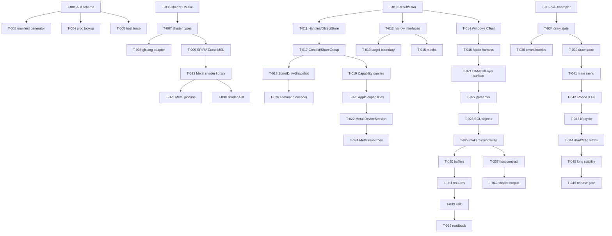

# 开发任务规格文档

## 文档信息
- **功能名称**：Direct Metal OpenGL 3.3 Core 全量重构
- **版本**：1.0
- **创建日期**：2026-08-12
- **作者**：Scrum Master Agent
- **关联故事**：`.boss/direct-metal-gl33/prd.md`
- **架构基线**：`.boss/direct-metal-gl33/architecture.md`
- **评审基线**：`.boss/direct-metal-gl33/tech-review.md`

## 摘要

> 这是执行顺序和质量门禁的唯一任务清单。新 target 从零建立；旧 `MG_Backend/DirectVulkan` 仅作行为取证参考，迁移期间不得进入新 target、不得作为 fallback。

- **任务总数**：46 个任务
- **前端任务**：14 个（ABI、GL 语义、EGL）
- **后端任务**：22 个（接口、Shader、Metal、资源）
- **QA/DevOps 任务**：10 个（测试、CI、真机和发布）
- **关键路径**：B1-B4（T-001~T-013）→ M1（T-014~T-029）→ M2（T-030~T-036）→ M3/M4（T-037~T-042）→ M5（T-043~T-046）
- **预估复杂度**：高；不得在 B1-B4 未全部通过前扩展到完整 GL 对象或 Minecraft 兼容开发

## 1. 任务概览

### 1.1 统计信息（计划值，按执行时去重）

| 指标 | 数量 |
|------|------|
| 总任务数 | 46 |
| 创建文件 | 约 55 |
| 修改文件 | 约 7（仅 CMake/CI/公共 ABI 适配） |
| 测试用例 | 约 150（单元、shader、Metal、trace、真机） |

### 1.2 任务分布

| 复杂度 | 数量 |
|--------|------|
| 低 | 8 |
| 中 | 17 |
| 高 | 21 |

## 2. 执行批次与门禁

### 批次 0：开发前阻塞项 B1-B4（T-001~T-013）

四项门禁必须全部通过，才能开始 M1。B1/B2/B3 可并行；B4 依赖三者的接口约定。

### 批次 1：M1 DirectMetal vertical slice（T-014~T-029）

交付 GLSL 330 triangle 从 ABI 调用、SPIR-V/MSL、Metal pipeline、CAMetalLayer 到 present 的最小闭环。Windows 纯 C++ 门禁和 Apple Metal 门禁均通过后才算 M1 完成。

### 批次 2：M2 GL Core 资源与 FBO（T-030~T-036）

扩展 Minecraft 必需的 buffer、texture、sampler、VAO、FBO、readback、固定功能状态；每项先写失败测试再实现。

### 批次 3：M3/M4 宿主与进入世界（T-037~T-042）

锁定 Amethyst/LWJGL ABI 和调用轨迹，完成主菜单、1.21.1 iPhone X 进入世界，再扩展版本矩阵。

### 批次 4：M5 稳定性与发布（T-043~T-046）

覆盖前后台、resize、内存压力、长稳、iPad/Mac 矩阵和发布证据。未完成不得使用“100%”支持口径。

## 3. 任务详情

### Story S-001：B1 ABI 契约与可观测清单

#### Task T-001：冻结版本化 ABI manifest 格式
**类型**：创建
**目标文件**：`abi/manifest/abi-manifest.schema.json`、`abi/manifest/README.md`
**实现步骤**：定义 symbol name、C 签名 hash、来源（GL/EGL/extension）、版本、实现状态（implemented/provisional/unsupported）、错误语义和宿主证据字段；manifest 版本独立于库版本；明确 provisional 不可用于发布声明。
**测试用例**：`tests/abi/manifest_schema_test.cpp`：schema 校验、重复符号拒绝、未知状态拒绝、签名字段缺失拒绝。
**复杂度**：中
**依赖**：无
**完成标志**：schema 可被 Windows 测试加载；示例 manifest 通过校验；文档写明不得为探测补空桩。

#### Task T-002：实现 ABI manifest 生成器
**类型**：创建
**目标文件**：`tools/abi/gen_manifest.ps1`、`tools/abi/gen_manifest.cpp`、`abi/manifest/gl-egl-manifest.json`
**实现步骤**：从公共头、导出符号输入和手工扩展元数据生成稳定 JSON；签名归一化；输出变更 diff；缺少实现状态时失败而不是默认为 implemented。
**测试用例**：`tests/abi/manifest_generator_test.cpp`：头文件新增/删除符号、C/C++ 名字修饰、签名变化和确定性排序。
**复杂度**：中
**依赖**：T-001
**完成标志**：同一输入重复运行字节级一致；manifest 覆盖当前 EGL 清单和公共 GL 头。

#### Task T-003：实现导出表与 manifest 校验
**类型**：创建/修改
**目标文件**：`tools/abi/check_exports.ps1`、`tests/abi/export_manifest_test.cpp`、`.github/workflows/build.yml`
**实现步骤**：在 Windows/macOS/iOS 产物上调用 `nm`/`dumpbin`，校验必需入口、C 符号可见性、签名 hash 和 unsupported/provisional 规则；禁止检查通过即代表行为实现。
**测试用例**：TC-003-1 缺符号失败；TC-003-2 多余私有符号不影响；TC-003-3 provisional 在 release 模式失败。
**复杂度**：中
**依赖**：T-001、T-002
**完成标志**：CI 有独立 ABI 门禁，输出可归档报告。

#### Task T-004：建立 `eglGetProcAddress`/GL lookup 契约测试
**类型**：创建
**目标文件**：`tests/abi/proc_address_test.cpp`、`src/abi/proc_table.h`（新 target）
**实现步骤**：定义支持入口、规范返回空的入口和错误入口；测试大小写、重复查询、无 current context 与线程并发；禁止返回 Stubs.cpp 空实现地址。
**测试用例**：TC-004-1 支持入口非空且可调用；TC-004-2 unsupported 返回空/规范错误；TC-004-3 未知名称稳定失败。
**复杂度**：中
**依赖**：T-001
**完成标志**：lookup 表由 manifest 生成或校验，不能人工漂移。

#### Task T-005：采集宿主 dlsym 轨迹并标注 provisional
**类型**：创建
**目标文件**：`tools/trace/README.md`、`tools/trace/dlsym_trace_schema.json`、`artifacts/abi/amethyst-lwjgl-1.21.1.json`
**实现步骤**：锁定 Amethyst/LWJGL commit 输入；定义不含账号/资源内容的调用轨迹格式；当前缺少宿主仓库时生成 provisional 记录并在 manifest 中标注阻塞项。
**测试用例**：`tests/trace/schema_test.cpp`：脱敏、版本字段、事件顺序和截断恢复。
**复杂度**：高
**依赖**：T-001
**完成标志**：记录 renderer 加载、EGL 初始化和第一帧所需符号；缺失外部证据不伪造通过。

### Story S-002：B2 构建与 Shader 工具链设计

#### Task T-006：切换 SPIRV-Cross MSL 构建选项
**类型**：修改
**目标文件**：`CMakeLists.txt`、`cmake/dependencies.cmake`、`3rdparty/SPIRV-Cross/CMakeLists.txt`（仅必要补丁）
**实现步骤**：新 target 启用 `SPIRV_CROSS_ENABLE_MSL/GLSL`，链接 `spirv-cross-msl` 与 core；锁定 submodule commit、许可证和缓存格式；旧 target 维持现状但不被新 target 引用。
**测试用例**：`tests/build/dependency_probe.cmake`：MSL target 可链接；产物无 MoltenVK/Vulkan runtime 依赖（允许 SPIR-V 工具符号）。
**复杂度**：中
**依赖**：无
**完成标志**：macOS/iOS configure 能找到 MSL backend；Windows 纯 C++ configure 不需要 Apple SDK。

#### Task T-007：定义 shader 编译领域接口与错误模型
**类型**：创建
**目标文件**：`src/shader/ShaderTypes.h`、`src/shader/ShaderCompiler.h`、`src/shader/ShaderError.h`
**实现步骤**：定义 `ShaderStage`、源码/预处理选项、SPIR-V blob、MSL source、反射 binding、结构化诊断和缓存 key；头文件不得含 Metal/Vulkan 类型。
**测试用例**：`tests/unit/shader_types_test.cpp`：key 稳定性、错误脱敏、stage/entry point 校验。
**复杂度**：中
**依赖**：T-006
**完成标志**：接口可被 mock 实现；禁止大而全的后端对象依赖。

#### Task T-008：实现 GLSL 330 预处理与 SPIR-V 编译适配器
**类型**：创建
**目标文件**：`src/shader/GlslPreprocessor.cpp`、`src/shader/GlslangCompiler.cpp`、`tests/shader/glslang_adapter_test.cpp`
**实现步骤**：保留 `#line`、注入受控版本/宏、设置资源限制；编译失败返回结构化日志和 source location；禁止复制旧 Vulkan builtin 重写。
**测试用例**：合法 vertex/fragment、宏和 include；非法语法、超长日志和并发编译。
**复杂度**：高
**依赖**：T-007
**完成标志**：最小 corpus 产出可验证 SPIR-V；失败不崩溃。

#### Task T-009：实现 SPIR-V 反射与 MSL 转换适配器
**类型**：创建
**目标文件**：`src/shader/SpirvCrossMslCompiler.cpp`、`src/shader/Reflection.cpp`、`tests/shader/spirv_msl_test.cpp`
**实现步骤**：用 `CompilerMSL` 生成 MSL；反射 UBO/sampler/attribute/output、数组和偏移；固定 binding policy 与 MSL profile；缓存 key 版本化。
**测试用例**：triangle corpus MSL 生成、binding 对齐、非法 SPIR-V、缓存损坏回退。
**复杂度**：高
**依赖**：T-007、T-008
**完成标志**：M1 最小链的 MSL 文本和反射值可供 Metal target 使用。

### Story S-003：B3 窄后端边界与领域核心

#### Task T-010：实现 Expected/Result 与错误分类
**类型**：创建
**目标文件**：`src/core/Expected.h`、`src/core/Result.h`、`src/core/Error.h`、`tests/unit/error_model_test.cpp`
**实现步骤**：定义无异常热路径结果、错误域（GL/EGL/Shader/Device/Surface/Resource）、可串联诊断；跨 ABI 映射由上层负责。
**测试用例**：成功/失败存储、移动、错误上下文、无分配错误路径。
**复杂度**：中
**依赖**：无
**完成标志**：Windows C++20 编译通过，ASan/UBSan 无报错。

#### Task T-011：实现强类型句柄与 ObjectStore 原型
**类型**：创建
**目标文件**：`src/core/Handles.h`、`src/core/ObjectStore.h`、`src/core/ObjectStore.cpp`、`tests/unit/object_store_test.cpp`
**实现步骤**：提供 kind/slot/generation 句柄；创建、查找、删除、名字复用和延迟销毁；后端对象通过 opaque payload 关联。
**测试用例**：过期句柄拒绝、跨 kind 拒绝、删除绑定对象、generation 溢出策略、并发读写边界。
**复杂度**：高
**依赖**：T-010
**完成标志**：无裸全局指针；所有权和销毁时机可在单测中观察。

#### Task T-012：拆分窄后端接口
**类型**：创建
**目标文件**：`src/backend/ResourceDevice.h`、`src/backend/ShaderCompilerDevice.h`、`src/backend/CommandEncoder.h`、`src/backend/Presenter.h`、`src/backend/Surface.h`
**实现步骤**：按资源、shader/pipeline、command、surface/present 拆分职责；接口只接领域值对象和句柄，不出现 GL enum、`Vk*`、`id<MTL*>`；方法数超过 12 自动触发复审。
**测试用例**：`tests/unit/backend_contract_compile_test.cpp`：头文件 AST/文本扫描、mock 可实现性、错误返回完整性。
**复杂度**：高
**依赖**：T-010、T-011
**完成标志**：新 target 只依赖窄接口；旧 `MG_Backend/Backend.h` 不被 include。

#### Task T-013：建立新 target 的依赖边界扫描
**类型**：创建/修改
**目标文件**：`cmake/direct_metal.cmake`、`tools/quality/scan_for_vulkan.ps1`、`tests/build/target_boundary_test.cpp`
**实现步骤**：新建 `mithril_direct_metal` target source list；扫描新 target 源码、编译命令、链接图和产物，禁止 DirectVulkan、MoltenVK、Vulkan headers/runtime；允许 3rdparty SPIR-V 工具但排除 Vulkan API。
**测试用例**：注入违规 include/link 时失败；旧 target 存在不影响新 target；新 target 不得有 fallback 分支。
**复杂度**：高
**依赖**：T-006、T-012
**完成标志**：Windows configure/build 可完成；Apple configure 明确只链接 Metal/QuartzCore/Foundation 等框架。

### Story S-004：B4 测试骨架与 Mock

#### Task T-014：建立跨平台 CTest/GoogleTest 纯 C++ target
**类型**：创建/修改
**目标文件**：`tests/CMakeLists.txt`、`tests/unit/CMakeLists.txt`、`cmake/testing.cmake`
**实现步骤**：Windows 可独立配置，不引入 Apple SDK、ObjC++、Vulkan；开启 warnings-as-errors、ASan/UBSan 开关；注册 CTest。
**测试用例**：空测试先失败后通过；Debug/Release 配置；无测试被静默跳过。
**复杂度**：中
**依赖**：T-010、T-012
**完成标志**：`ctest --output-on-failure` 可在 Windows CI 运行。

#### Task T-015：实现 Mock Resource/Command/Presenter
**类型**：创建
**目标文件**：`tests/mocks/MockResourceDevice.h`、`tests/mocks/MockCommandEncoder.h`、`tests/mocks/MockPresenter.h`、`tests/fixtures/triangle_fixture.h`
**实现步骤**：记录调用序列、句柄生命周期、错误注入和 surface generation；mock 不依赖 Metal/Vulkan。
**测试用例**：调用顺序、错误传播、资源延迟回收、nil surface 注入。
**复杂度**：中
**依赖**：T-012、T-014
**完成标志**：GL/IR 单元测试无需真实 GPU 即可验证。

#### Task T-016：建立 Apple Metal 测试 target 与 golden harness
**类型**：创建
**目标文件**：`tests/metal/CMakeLists.txt`、`tests/metal/MetalTestHost.mm`、`tests/metal/GoldenReadback.mm`、`tests/golden/triangle_rgba8.bin`
**实现步骤**：为 macOS arm64/iOS arm64 配置 ObjC++/ARC；提供离屏 texture、readback hash、Metal validation 环境变量和失败 artifact 保存。
**测试用例**：设备缺失可诊断跳过（仅非发布）；triangle golden hash；validation error 使测试失败。
**复杂度**：高
**依赖**：T-014、T-015
**完成标志**：Apple runner 可构建并运行最小 Metal test；发布门禁禁止跳过。

### Story S-005：M1 GL 语义核心

#### Task T-017：实现 Context/ShareGroup/DeviceSession 生命周期
**类型**：创建
**目标文件**：`src/gl/Context.h`、`src/gl/Context.cpp`、`src/gl/ShareGroup.h`、`src/gl/ShareGroup.cpp`、`src/backend/DeviceSession.h`
**实现步骤**：实现 thread-local current、共享组校验、设备能力指纹、确定性销毁顺序和错误队列入口。
**测试用例**：`tests/unit/context_lifecycle_test.cpp`：线程隔离、共享/不共享 context、重复销毁、设备不匹配。
**复杂度**：高
**依赖**：T-010、T-011、T-012、T-014
**完成标志**：Windows mock 路径全通过；无 Vulkan/Metal 类型泄漏。

#### Task T-018：实现 GL 基础状态与 DrawSnapshot 值对象
**类型**：创建
**目标文件**：`src/gl/State.h`、`src/gl/State.cpp`、`src/ir/DrawSnapshot.h`、`src/ir/RenderPassDesc.h`、`tests/unit/state_snapshot_test.cpp`
**实现步骤**：定义 dirty tracking、默认状态、viewport/scissor、blend/depth/stencil/raster、不可变 draw snapshot；只保留被 M1 用例驱动字段。
**测试用例**：同值不标脏、状态快照隔离、pipeline key 归一化、默认 FBO 描述。
**复杂度**：高
**依赖**：T-011、T-017
**完成标志**：编码器不读取可变 GLState；快照可序列化用于调试（非通用 VM）。

#### Task T-019：实现 CapabilityManifest 与 GL 查询映射
**类型**：创建
**目标文件**：`src/capability/CapabilityManifest.h`、`src/capability/CapabilityManifest.cpp`、`src/abi/CapabilityQueries.cpp`、`tests/unit/capability_manifest_test.cpp`
**实现步骤**：定义 GPU family、格式、最大尺寸、可选 shared event/counter/binary archive/argument buffer；查询结果驱动 `glGet*`/扩展，未实现项返回规范错误。
**测试用例**：A11 能力降级、Intel/Apple family 差异、禁止虚报扩展、manifest 序列化稳定。
**复杂度**：高
**依赖**：T-010、T-017
**完成标志**：无硬编码机型作为唯一判据；M1 不依赖可选能力。

### Story S-006：M1 Apple 平台与 Metal 设备

#### Task T-020：实现 Apple CapabilityManifest 采集
**类型**：创建
**目标文件**：`src/platform/apple/AppleCapabilities.mm`、`src/platform/apple/AppleCapabilities.h`、`tests/metal/apple_capabilities_test.mm`
**实现步骤**：安全查询 `MTLDevice` selector、GPU family、feature set、格式支持、内存预算；把结果转成平台无关 manifest。
**测试用例**：A11/iOS16、Apple Silicon、Intel Mac fixture；selector 不可用时降级。
**复杂度**：高
**依赖**：T-019、T-016
**完成标志**：缺少 optional selector 不阻断 context；能力证据可归档。

#### Task T-021：实现 CAMetalLayer/Surface 生命周期契约
**类型**：创建
**目标文件**：`src/platform/apple/MetalSurface.mm`、`src/platform/apple/MetalSurface.h`、`tests/metal/surface_lifecycle_test.mm`
**实现步骤**：只接收真实 `CAMetalLayer` 或安全创建的 layer；禁止 `object_setClass`；处理 nil drawable、resize、前后台和 generation token。
**测试用例**：nil layer/drawable、尺寸变化、旧 drawable 延迟释放、重复 present、后台恢复。
**复杂度**：高
**依赖**：T-016、T-020
**完成标志**：Surface 接口不泄漏 ObjC 指针到 C++ 公共头；validation 0 error。

#### Task T-022：实现 Metal DeviceSession/FrameScheduler
**类型**：创建
**目标文件**：`src/metal/MetalDeviceSession.mm`、`src/metal/MetalDeviceSession.h`、`src/metal/FrameScheduler.mm`、`src/metal/FrameScheduler.h`、`tests/metal/device_session_test.mm`
**实现步骤**：创建 device/queue、2–3 帧 in-flight、command-buffer completion、deferred release 和 device lost 错误；正常路径禁止无界 `waitUntilCompleted`。
**测试用例**：设备创建失败、command buffer error、完成序列、资源回收和内存压力注入。
**复杂度**：高
**依赖**：T-020、T-021
**完成标志**：Metal 类型只在 `src/metal`/Apple 私有实现；mock 可替换调度器。

### Story S-007：M1 Shader、资源、管线与编码

#### Task T-023：接通 ShaderCompiler 到 Metal library
**类型**：创建
**目标文件**：`src/metal/MetalShaderCompiler.mm`、`src/metal/MetalShaderCompiler.h`、`tests/metal/shader_library_test.mm`
**实现步骤**：调用 T-008/T-009 产出 MSL；用 `newLibraryWithSource` 编译并返回结构化 Metal 日志；按 cache key 缓存成功/失败结果。
**测试用例**：合法 triangle、MSL 编译失败、缓存命中/损坏回退、A11 profile。
**复杂度**：高
**依赖**：T-009、T-022
**完成标志**：GLSL→SPIR-V→MSL→Metal library 端到端通过。

#### Task T-024：实现 M1 buffer/texture/sampler 资源工厂
**类型**：创建
**目标文件**：`src/metal/MetalResources.mm`、`src/metal/MetalResources.h`、`tests/metal/resource_factory_test.mm`
**实现步骤**：实现 triangle 所需 vertex/index/uniform buffer、RGBA texture、sampler；句柄映射、staging 和帧代回收。
**测试用例**：空/零尺寸、写入后读回、错误格式、completion 后销毁。
**复杂度**：高
**依赖**：T-011、T-022
**完成标志**：资源工厂满足窄接口，GPU 未完成前不释放。

#### Task T-025：实现 pipeline key 与 Metal render pipeline
**类型**：创建
**目标文件**：`src/metal/MetalPipeline.mm`、`src/metal/MetalPipeline.h`、`tests/metal/pipeline_key_test.mm`
**实现步骤**：根据 shader/layout/attachment/固定状态生成规范化 key；创建 render/depth-stencil state；缓存失败结果并限制内存。
**测试用例**：同 key 复用、附件格式变化、blend/depth/cull 差异、编译错误诊断。
**复杂度**：高
**依赖**：T-023、T-024
**完成标志**：不引入 binary archive/argument buffer 硬依赖。

#### Task T-026：实现 RenderPass/CommandEncoder M1
**类型**：创建
**目标文件**：`src/metal/MetalCommandEncoder.mm`、`src/metal/MetalCommandEncoder.h`、`tests/metal/triangle_encode_test.mm`
**实现步骤**：消费 `RenderPassDesc`/`DrawSnapshot`，编码 viewport/scissor、pipeline、资源、vertex/index 和 draw；encoder 不读取 GLState。
**测试用例**：triangle、indexed triangle、空 draw、nil drawable、编码错误传播。
**复杂度**：高
**依赖**：T-018、T-024、T-025
**完成标志**：离屏 triangle 生成预期命令序列和 golden。

#### Task T-027：实现 Presenter 与 surface generation
**类型**：创建
**目标文件**：`src/metal/MetalPresenter.mm`、`src/metal/MetalPresenter.h`、`tests/metal/presenter_test.mm`
**实现步骤**：获取 drawable、建立默认 FBO render target、在同一 command buffer 调用 present、处理 generation 变化和 drawable starvation。
**测试用例**：正常 present、nil drawable 重试/跳帧策略、resize 丢弃旧 target、command buffer failure。
**复杂度**：高
**依赖**：T-021、T-022、T-026
**完成标志**：无跨帧裸 drawable；present 路径无 CPU 等待。

### Story S-008：M1 EGL/GL ABI 最小闭环

#### Task T-028：实现新 EGL display/config/context/surface 入口
**类型**：创建/修改
**目标文件**：`src/abi/egl.cpp`、`src/abi/egl_objects.h`、`tests/abi/egl_context_test.cpp`
**实现步骤**：将现有 `egl/egl.cpp` 入口迁移到新 ABI 层；EGLDisplay 持有 DeviceSession，EGLContext 持有 Context，配置由 manifest 派生；明确 BAD_MATCH/BAD_NATIVE_WINDOW 等错误。
**测试用例**：初始化/终止、config 选择、重复 context、share group 不匹配、错误 native window。
**复杂度**：高
**依赖**：T-017、T-019、T-021、T-022
**完成标志**：新 target 不 include 旧 `egl.cpp`；manifest/导出测试通过。

#### Task T-029：实现 `eglMakeCurrent`/`eglSwapBuffers` 最小路径
**类型**：创建
**目标文件**：`src/abi/egl_current.cpp`、`src/abi/egl_present.cpp`、`tests/abi/egl_triangle_smoke_test.cpp`
**实现步骤**：绑定 thread-local Context；将默认 FBO 与 Presenter 对接；swap 轮询 completion、编码并 present；surface 失效返回可恢复错误。
**测试用例**：make current 切换、无 current context、swap interval、surface resize、triangle smoke。
**复杂度**：高
**依赖**：T-027、T-028
**完成标志**：M1 ABI→Metal triangle→present 闭环完成。

### Story S-009：M2 GL Core 资源与 FBO

#### Task T-030：实现 buffer 创建/更新/map 与 upload allocator
**类型**：创建
**目标文件**：`src/gl/BufferObjects.cpp`、`src/metal/MetalBuffer.mm`、`tests/unit/buffer_object_test.cpp`、`tests/metal/buffer_upload_test.mm`
**实现步骤**：覆盖 Minecraft 使用的 target/usage、subdata、map/unmap、copy、ring/staging 和 fence 保护。
**测试用例**：非对齐更新、映射冲突、孤儿化、GPU 未完成覆盖、OOM。
**复杂度**：高
**依赖**：T-011、T-022、T-024、T-029
**完成标志**：无 UAF；upload allocator 指标可观测。

#### Task T-031：实现 texture/format/pixel-store/mipmap
**类型**：创建
**目标文件**：`src/gl/TextureObjects.cpp`、`src/metal/MetalTexture.mm`、`src/metal/FormatMap.mm`、`tests/unit/format_map_test.cpp`、`tests/metal/texture_upload_test.mm`
**实现步骤**：定义颜色/sRGB/depth/stencil/integer 支持表；实现 unpack alignment/row length/skip、NPOT、mipmap、replace/blit。
**测试用例**：1x1/零尺寸、非紧密行、mip 不完整、格式错误、readback round-trip。
**复杂度**：高
**依赖**：T-019、T-024、T-030
**完成标志**：每个声明支持格式有 golden 或 round-trip 证据。

#### Task T-032：实现 sampler 与 VAO/vertex descriptor
**类型**：创建
**目标文件**：`src/gl/SamplerObjects.cpp`、`src/gl/VertexArrayObjects.cpp`、`src/metal/MetalVertexDescriptor.mm`、`tests/unit/vao_sampler_test.cpp`
**实现步骤**：实现 attribute format/stride/offset/divisor、index 类型、sampler state 和固定 slot 映射；删除对象后绑定状态可预测。
**测试用例**：整数/归一化属性、跨 buffer attribute、instancing divisor、sampler 参数边界。
**复杂度**：高
**依赖**：T-018、T-024、T-025、T-030
**完成标志**：Minecraft 顶点布局 trace 可重放。

#### Task T-033：实现 FBO/renderbuffer/blit/默认 FBO
**类型**：创建
**目标文件**：`src/gl/FramebufferObjects.cpp`、`src/metal/MetalRenderTarget.mm`、`tests/unit/fbo_completeness_test.cpp`、`tests/metal/fbo_golden_test.mm`
**实现步骤**：附件生命周期、completeness、load/store、resolve、clear、invalidate、默认 FBO generation 和 resize。
**测试用例**：多附件、深度模板、尺寸/格式不匹配、附件删除、反馈回路、FBO 0 resize。
**复杂度**：高
**依赖**：T-021、T-031、T-032
**完成标志**：离屏 FBO golden 与 Metal validation 通过。

#### Task T-034：实现 draw/clear/blend/depth/stencil/cull
**类型**：创建/修改
**目标文件**：`src/gl/DrawingCore.cpp`、`src/metal/MetalFixedState.mm`、`tests/metal/draw_state_golden_test.mm`
**实现步骤**：覆盖 Minecraft 使用的 arrays/elements/instanced、primitive、viewport/scissor、blend方程、depth/stencil、cull/front-face、color mask、clear。
**测试用例**：透明叠加、深度遮挡、模板裁剪、空 draw、附件格式切换、索引越界错误。
**复杂度**：高
**依赖**：T-026、T-031、T-032、T-033
**完成标志**：每一固定状态至少一个独立 golden；不支持组合显式报错。

#### Task T-035：实现 `glReadPixels` 与 staging readback
**类型**：创建
**目标文件**：`src/gl/Readback.cpp`、`src/metal/MetalReadback.mm`、`tests/metal/readback_test.mm`
**实现步骤**：blit 到 shared staging，处理 pack alignment/row length/format conversion；仅 readback 明确允许有限等待。
**测试用例**：默认/离屏 FBO、非紧密 pack、边界矩形、无 drawable、command failure。
**复杂度**：高
**依赖**：T-033、T-034
**完成标志**：triangle/texture hash 稳定，等待有界且可记录。

#### Task T-036：补齐 GL 错误队列与 Core 查询语义
**类型**：创建/修改
**目标文件**：`src/gl/ErrorQueue.cpp`、`src/abi/gl_errors.cpp`、`tests/unit/gl_error_semantics_test.cpp`
**实现步骤**：集中校验 enum/value/operation、对象绑定和 FBO 状态；实现已承诺的 `glGet*`，未实现 Core 能力返回规范错误；移除旧 Stubs 静默成功路径。
**测试用例**：错误优先级/清空、无 current context、删除后使用、unsupported query、debug callback。
**复杂度**：高
**依赖**：T-019、T-028、T-034
**完成标志**：ABI manifest 中无“声明存在但状态未知”；静默 no-op 扫描为零。

### Story S-010：M3 宿主接入与主菜单

#### Task T-037：锁定 Amethyst-iOS/LWJGL 接入契约
**类型**：创建
**目标文件**：`artifacts/host/amethyst-lock.json`、`artifacts/host/lwjgl-symbol-trace.json`、`docs/host-contract.md`
**实现步骤**：记录准确仓库/分支/commit、renderer 加载方式、dlsym 顺序、线程/Surface 生命周期和 Java 版本；补齐 T-005 provisional 项。
**测试用例**：trace schema、版本漂移检测、符号调用顺序回放。
**复杂度**：高
**依赖**：T-005、T-029、T-036
**完成标志**：外部宿主证据可复现；缺失项明确阻塞而不猜测。

#### Task T-038：迁移 GL shader/program ABI
**类型**：创建/修改
**目标文件**：`src/abi/gl_shader.cpp`、`src/abi/gl_program.cpp`、`tests/trace/shader_program_replay_test.cpp`
**实现步骤**：把 compile/link/status/log/attrib/uniform 查询接到新 shader/domain 模型；保持 LWJGL 需要的 C ABI 和错误语义。
**测试用例**：1.21.1 shader trace、非法 shader、未使用 uniform、显式绑定和长日志。
**复杂度**：高
**依赖**：T-023、T-028、T-037
**完成标志**：主菜单 shader corpus 100% 通过，旧 `MG_Impl/Shader.cpp` 不进新 target。

#### Task T-039：迁移 VAO/draw ABI 与 trace replay
**类型**：创建/修改
**目标文件**：`src/abi/gl_draw.cpp`、`src/trace/TraceReader.cpp`、`src/trace/TraceReader.h`、`tests/trace/draw_replay_test.cpp`
**实现步骤**：将宿主 draw 调用映射为 DrawSnapshot；trace 不包含账号/原始资源内容，仅保留结构和 hash；错误序列可比对。
**测试用例**：主菜单 draw trace、索引/实例化、状态变更顺序、截断 trace。
**复杂度**：高
**依赖**：T-032、T-034、T-037
**完成标志**：macOS replay framebuffer hash 与参考一致。

#### Task T-040：构建跨版本 Minecraft shader corpus
**类型**：创建
**目标文件**：`tests/shader/corpus/{1.17.1,1.18.2,1.19.4,1.20.1,1.20.6,1.21.1}/manifest.json`、`tools/shader/minimize_corpus.ps1`
**实现步骤**：从合法测试安装提取去版权化/最小化 shader；记录 stage、defines、预期 bindings、golden hash；版本变更触发 corpus diff。
**测试用例**：全 corpus 编译/链接/MSL；失败项阻断对应版本声明。
**复杂度**：高
**依赖**：T-009、T-037
**完成标志**：1.21.1 P0 corpus 完整，1.17.1+ 代表版本有明确结果。

#### Task T-041：主菜单启动烟测
**类型**：创建
**目标文件**：`tests/integration/minecraft_main_menu.ps1`、`artifacts/minecraft/main-menu-baseline.json`、`docs/runbooks/main-menu.md`
**实现步骤**：锁定 Vanilla 资产/Java runtime/启动参数；自动收集 dylib 加载、EGL、shader、首帧、崩溃和截图证据；失败按层级分类。
**测试用例**：冷启动、二次启动、无 shader cache、窗口 resize、前后台一次。
**复杂度**：高
**依赖**：T-038、T-039、T-040
**完成标志**：主菜单可交互且证据包可归档；不得以仅进程存活代替画面验收。

### Story S-011：M4 iPhone X 进入世界与平台矩阵

#### Task T-042：iPhone X/A11/iOS16.7.15 1.21.1 P0 流程
**类型**：创建
**目标文件**：`tests/device/iphone-x-1.21.1.yaml`、`tools/device/run_iphone_p0.sh`、`artifacts/device/iphone-x/README.md`
**实现步骤**：执行冷启动→主菜单→固定种子创建/加载世界→10 分钟交互；记录设备、OS、GPU、日志、截图/录像和退出码。
**测试用例**：首次 shader 编译、缓存命中、切后台/返回、方向/尺寸变化。
**复杂度**：高
**依赖**：T-041、T-035、T-036
**完成标志**：所有步骤 100% 通过，Metal validation/crash/黑屏为零；无设备时明确标记未验证。

#### Task T-043：前后台、resize 与 drawable 压力回归
**类型**：创建
**目标文件**：`tests/device/lifecycle-stress.yaml`、`tests/metal/surface_stress_test.mm`、`docs/runbooks/lifecycle.md`
**实现步骤**：重复 10 次后台/前台、旋转/resize、nil drawable、内存警告；检查 generation、延迟释放和恢复帧。
**测试用例**：drawable starvation、旧 surface present、command buffer error 恢复、无泄漏。
**复杂度**：高
**依赖**：T-021、T-027、T-042
**完成标志**：10/10 循环无崩溃、黑屏、UAF 或 validation error。

#### Task T-044：iPad 与 Mac Metal 2+ 矩阵
**类型**：创建
**目标文件**：`tests/device/matrix.yaml`、`tools/device/run_matrix.ps1`、`artifacts/device/matrix/README.md`
**实现步骤**：冻结最低 iPadOS/macOS、Apple Silicon 与 Intel Mac 设备；分别执行主菜单、进世界、resize 和读回；按 capability 记录降级。
**测试用例**：每个组合冷启动和 10 分钟稳定；未提供真机证据的组合保持 unsupported。
**复杂度**：高
**依赖**：T-042、T-043、T-020
**完成标志**：矩阵结果可机器解析；支持声明只从通过项生成。

### Story S-012：M5 稳定性、性能与发布门禁

#### Task T-045：30 分钟长稳与资源增长测试
**类型**：创建
**目标文件**：`tests/device/long_stability.yaml`、`tools/diagnostics/collect_metrics.ps1`、`artifacts/stability/report.schema.json`
**实现步骤**：固定种子生存世界 30 分钟；采集帧时间、pipeline cache、in-flight、Metal 内存、drawable starvation、错误和崩溃。
**测试用例**：正常移动/打开菜单/加载区块；内存压力和 shader cache 清空场景。
**复杂度**：高
**依赖**：T-042、T-043、T-044
**完成标志**：无崩溃/validation error/单调内存增长；P95 指标在发布阈值内。

#### Task T-046：发布 Capability/ABI/零 Vulkan 质量门禁
**类型**：创建/修改
**目标文件**：`tools/release/generate_capability_manifest.ps1`、`tools/release/verify_artifacts.ps1`、`.github/workflows/build.yml`、`docs/support-matrix.md`、`artifacts/release/release-gate.json`
**实现步骤**：汇总 ABI、shader、Metal golden、真机矩阵和长稳证据；扫描源码/产物/链接图中的 Vulkan/MoltenVK/DirectVulkan；生成只包含通过组合的支持矩阵；任何 provisional、跳过或预期失败阻断 release。
**测试用例**：篡改 manifest、注入 MoltenVK 链接、缺少设备证据、未实现扩展声明均必须失败。
**复杂度**：高
**依赖**：T-003、T-013、T-040、T-044、T-045
**完成标志**：iOS arm64、macOS arm64/x86_64（仅在 runner 实测时）Release 构建可复现；质量门禁全绿后才允许发布。

## 4. 实现前检查清单

- [ ] 已阅读 PRD、架构和 Tech Lead 评审，并确认“100%”仅指冻结矩阵。
- [ ] 已完成 T-001~T-016（B1-B4），否则禁止进入 M1。
- [ ] 新 target 与旧 `DirectVulkan` source list 分离；没有 fallback 或双状态生命周期。
- [ ] Windows 测试不依赖 Apple SDK、Objective-C++、Vulkan 或 MoltenVK。
- [ ] Apple 测试具备 Metal API Validation 与 golden artifact 输出。
- [ ] Amethyst/LWJGL commit、Minecraft 资产、Java runtime、签名/JIT 和设备预约已记录；缺失项保持 provisional。
- [ ] 每个实现任务先提交失败测试，再提交实现；禁止静默 no-op。

## 5. 任务依赖图

## 6. 文件变更汇总

### 6.1 新建文件（主要路径）

| 路径 | 任务 | 说明 |
|------|------|------|
| `src/core/*` | T-010~T-011 | Expected/Result、错误、强类型句柄、对象仓库 |
| `src/backend/*` | T-012、T-017 | 窄接口、DeviceSession、FrameScheduler |
| `src/gl/*` | T-017~T-018、T-030~T-036 | Context、状态、GL 对象和错误语义 |
| `src/ir/*` | T-018 | DrawSnapshot、RenderPassDesc |
| `src/shader/*` | T-007~T-009 | GLSL/SPIR-V/MSL 和反射领域层 |
| `src/capability/*` | T-019 | 能力清单和查询映射 |
| `src/metal/*` | T-022~T-027、T-030~T-035 | Direct Metal 设备、资源、编码、呈现 |
| `src/platform/apple/*` | T-020~T-021 | Metal 能力和 CAMetalLayer 适配 |
| `src/abi/*` | T-003~T-004、T-028~T-029、T-036~T-039 | C ABI、EGL/GL 参数校验与 lookup |
| `src/trace/*` | T-039 | 脱敏 trace replay |
| `tests/{unit,shader,metal,trace,abi,device}/*` | 全部 | 分层测试与设备脚本 |
| `tools/{abi,trace,quality,device,release}/*` | T-002~T-005、T-013、T-041~T-046 | 生成、扫描、运行和证据工具 |

### 6.2 修改文件（受限）

| 路径 | 任务 | 约束 |
|------|------|------|
| `CMakeLists.txt`、`cmake/*` | T-006、T-013、T-014、T-046 | 新 target 从零定义；不得把旧 Vulkan 文件加入新 target |
| `.github/workflows/build.yml` | T-003、T-006、T-046 | 增加 ABI、零 Vulkan、Windows/Apple、golden 门禁；旧 Vulkan 检查不得成为新实现依赖 |
| `include/GL/*`、`include/EGL/*` | T-003、T-028、T-038 | 仅在 manifest/真实调用轨迹证明后修改；保持 ABI 签名 |
| 旧 `MG_*` 源码 | 迁移阶段只读参考 | 禁止直接改成“Metal 版”后混入新 target；删除需由独立迁移验收任务授权 |

## 7. 代码规范提醒

- 公共 C/C++ 头不得包含 Vulkan、MoltenVK、Metal/Objective-C 类型；Metal 只在 `src/metal` 和 Apple 私有实现。
- 所有权使用 RAII、generation handle 和 command-buffer completion；禁止全局裸指针、跨帧裸 drawable、隐式单例销毁顺序。
- 后端接口保持窄职责；mock 不应需要理解 GLState 或 Metal 细节。
- Render IR 仅允许 `DrawSnapshot`、`RenderPassDesc` 和当前用例需要的绑定值对象，不设计通用指令 VM。
- 单文件原则上不超过 500 行；接口达到 12 个方法必须复审。
- 错误由 ABI/GL 层映射；未实现能力必须返回规范错误，禁止为了通过探测而 silent no-op 或虚报扩展。
- 每项任务先失败测试后实现；warnings-as-errors、ASan/UBSan/Metal validation 失败不得合并。

## 变更记录

| 版本 | 日期 | 作者 | 变更内容 |
|------|------|------|----------|
| 1.0 | 2026-08-12 | Scrum Master Agent | 按 B1-B4 → M1 → M2 → M3/M4 → M5 拆解 46 个文件级任务，定义测试与发布门禁 |
