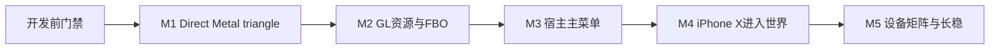

# 技术方案评审报告

## 1. 评审概述

- **项目名称**：Mithril Direct Metal OpenGL 3.3 Core 全量重构
- **评审日期**：2026-08-12
- **评审人**：Tech Lead Agent
- **评审文档**：
  - PRD：`.boss/direct-metal-gl33/prd.md`
  - 架构：`.boss/direct-metal-gl33/architecture.md`
- **代码基线**：`refactor/gl33-core-metal2`，基于 `e53d7a6`

## 摘要

> 下游 Agent 请优先阅读本节。本文区分“允许开始 M1 开发”和“允许发布兼容声明”，两者不得混用。

- **评审结论**：⚠️ 有条件通过。
- **开发结论**：完成第 5.1 节 4 个开发前阻塞项后，可以启动 M1；真机和 Minecraft 资产缺失不阻塞纯 C++ 与 Metal 垂直切片开发。
- **发布结论**：当前不可发布，也不可声称 Minecraft 1.21.1、iPhone/iPad/Mac 或“100% 进入游戏”已达成。
- **主要风险**：宿主 ABI 尚未由真实 `dlsym` 轨迹证明；GLSL→MSL 构建链尚未启用；A11 可选 Metal 能力可能被误当硬依赖；新后端接口与 Render IR 有过度抽象风险。
- **必须解决**：冻结最小 ABI 清单与测试；修正 shader/CMake 方案；拆分后端契约；建立 Windows 与 Apple 双层 M1 测试门禁。
- **技术债务**：现有公共头是项目自定义子集，部分 Core 能力只有符号或状态影子；旧 Vulkan 语义不可直接迁移为新实现。

---

## 2. 评审结论

| 维度 | 评分 | 说明 |
|------|------|------|
| 架构合理性 | ⭐⭐⭐⭐☆ | Direct Metal 唯一运行时、分层所有权和垂直切片方向正确，但接口与 IR 需收窄 |
| 技术选型 | ⭐⭐⭐⭐☆ | glslang + SPIRV-Cross MSL 可行且不需要 Vulkan runtime，构建配置尚未迁移 |
| 可扩展性 | ⭐⭐⭐☆☆ | 能力驱动适合多代 Apple GPU；通用 Render IR 容易提前设计过度 |
| 可维护性 | ⭐⭐⭐⭐☆ | 强类型句柄、RAII、帧代回收正确；必须限制接口规模和跨层类型 |
| 安全性/稳定性 | ⭐⭐⭐☆☆ | 生命周期策略合理，但无 A11 真机、前后台与 drawable 压力证据 |

**总体评价**：方案在工程上可执行，且 Direct Metal 可以成为唯一 runtime；但架构文档仍含若干未经设备和宿主验证的能力假设。完成开发前门禁后允许 M1，不允许把 M1 开发许可解释为发布许可。

## 3. 关键技术判定

### 3.1 Direct Metal 唯一 runtime 与零 Vulkan/MoltenVK

- **判定：可执行。** Metal 2+ 足以承载 Minecraft 所需的主流 buffer、texture、sampler、FBO、固定功能状态和 draw 路径。
- 新产物必须只链接 Apple frameworks 与 shader 编译静态库；不得链接、弱链接、`dlopen` 或运行时探测 Vulkan/MoltenVK。
- `glslang` 生成 SPIR-V 是中间表示，不等于引入 Vulkan runtime；源码/产物零痕迹门禁应针对 Vulkan API、MoltenVK 动态依赖和后端类型，不应误杀合法 SPIR-V 工具代码。
- 旧 `DirectVulkan` 仅可作为行为取证参考，不进入新 target，不保留 fallback，也不得形成双状态或双资源生命周期。

### 3.2 GLSL → SPIR-V → MSL 工具链

- **判定：可行，但当前构建不支持。** 现有 CMake 明确设置 `SPIRV_CROSS_ENABLE_MSL=OFF` 和 `SPIRV_CROSS_ENABLE_GLSL=OFF`，只链接 `spirv-cross-core`。
- SPIRV-Cross 的 MSL target 要求同时启用 GLSL support；迁移后至少链接 `spirv-cross-msl`，并保留反射所需 core。
- 现有 `Shader.cpp` 带有 Vulkan 专用的 builtin 重写、Z/Y 修正、宽松 Vulkan rules 和 UBO 包装，不能原样复用。必须以 shader corpus 测试驱动，重新定义 GL 坐标、uniform 布局、sampler/attribute binding 和 MSL profile。
- M1 必须先证明一条最小链：GLSL 330 vertex/fragment → SPIR-V → `CompilerMSL` → MSL → `newLibraryWithSource`，并校验反射绑定，而非只检查字符串生成成功。

### 3.3 A11 / iPhone X 能力边界

- `MTLSharedEvent`、`MTLCounterSampleBuffer`、`MTLBinaryArchive`、argument buffer 均不得作为 M1 或 A11 基线必备能力。
- `CapabilityManifest` 必须在运行时查询 API 可用性、selector、GPU family 和 feature support，并为每个可选能力提供不改变正确性的 fallback。
- 基线路径采用固定 buffer/texture/sampler slot、command-buffer completion 和普通 pipeline cache；缺少 counter 时不得伪造 query 数值或虚假扩展。
- 可选优化必须在 capability 单元测试和 A11 真机验证后启用；能力探测失败只能降级，不得导致 context 创建失败。

### 3.4 GL/EGL ABI 与 Minecraft/LWJGL

- 现有 `glcorearb.h` 是 focused/custom API surface，不是 Khronos 完整 GL 3.3 Core 头；“头中有声明”和“源码有符号”不能证明 LWJGL/Amethyst 会成功解析及正确调用。
- CI 只验证约 44 个 EGL 入口和少量 GL 样例，无法证明 Minecraft 1.21.1 所需 GL/EGL/扩展全集。
- 开发前可以使用仓库现有 ABI 作为起点，但必须生成机器可读 manifest，覆盖名称、签名、版本/扩展、实现状态和规范错误行为。
- 真正的 P0 ABI 清单必须来自锁定的 Amethyst/LWJGL commit 的 `dlsym` 轨迹与 Minecraft 1.21.1 调用轨迹；在取得轨迹前，所有清单均标记 provisional。
- 不允许为通过符号探测而给未实现能力返回成功、假结果或无操作；未支持项应不宣称扩展，或按规范返回错误。

## 4. 技术风险评估

| 风险 | 等级 | 影响范围 | 缓解措施 |
|------|------|----------|----------|
| MSL 语义与绑定错误 | 高 | shader 编译、画面正确性、进入世界 | corpus、反射断言、Metal 编译、离屏 golden |
| ABI/扩展清单缺失 | 高 | LWJGL 初始化直接退出 | manifest、导出测试、真实 dlsym/trace 补证 |
| A11 可选能力误作必备 | 高 | context 创建、同步、查询、性能 | runtime capability + 基线 fallback |
| drawable/异步资源 UAF | 高 | 前后台、resize、长稳 | generation、in-flight token、completion 延迟释放 |
| `IRenderDevice` 巨型接口 | 中高 | 可维护性、mock 成本、耦合 | 按资源/编译/编码/呈现拆分窄契约 |
| Render IR 过度抽象 | 中高 | 工期、热路径开销、调试困难 | 仅表达 Metal 编码需要的不可变 draw snapshot |
| pipeline key 爆炸 | 中高 | 卡顿和内存 | 状态归一化、指标、LRU；binary archive 仅可选 |
| 缺真机/资产却提前宣称成功 | 高 | 发布可信度 | 独立发布门禁，证据不齐即禁止发布 |

## 5. 架构改进要求

### 5.1 开发前阻塞项

- [ ] **B1 最小 ABI 契约**：建立版本化 `abi-manifest` 和自动测试，至少覆盖当前公共 GL/EGL 头、CI EGL 清单、`eglGetProcAddress`/`glXGetProcAddress` 解析、签名一致性和实现状态；真实宿主轨迹缺失项标记 provisional，不阻塞 M1。
- [ ] **B2 Shader 构建设计**：提交可构建的依赖方案，明确启用 `SPIRV_CROSS_ENABLE_GLSL/MSL`、链接目标、锁定 submodule commit、许可证、缓存版本和不含 Vulkan runtime 的判定方式。
- [ ] **B3 收窄后端边界**：撤回当前单个 `IRenderDevice` 大接口草案，拆为资源工厂、shader/pipeline 编译、command encoder、surface/present 等窄接口；任何接口都不得含 GL enum、`Vk*` 或 `id<MTL*>`。
- [ ] **B4 M1 测试骨架**：先建立 Windows 可运行的纯 C++ 测试 target 与 macOS/iOS Metal 测试 target；最小失败测试先于实现提交。

以上 4 项是开始 M1 实现前的阻塞项，不要求先获得 Minecraft 资产或真机。

### 5.2 必须纳入任务拆解

- [ ] Render IR 限定为 `DrawSnapshot`、`RenderPassDesc` 与少量资源绑定值对象，不设计跨后端通用指令集、序列化 VM 或多后端调度框架。
- [ ] Metal 类型只存在于 `src/metal` 与 `src/platform/apple` 私有实现；C++ 头使用 PImpl/opaque handle，ARC 所有权有单一边界。
- [ ] M1 不实现 query、transform feedback、binary archive、argument buffer 优化；只预留经过用例证明的扩展点。
- [ ] EGL surface 必须安全接收/创建 `CAMetalLayer`，禁止 `object_setClass`；nil drawable、resize、前后台必须有明确状态转换。
- [ ] 所有能力声明由真实实现和测试派生，不沿用旧 `glGetString`/扩展字符串。

## 6. M1 测试先行质量门禁

### 6.1 Windows 纯 C++ 门禁

- [ ] 能独立配置和运行，无 Apple SDK、Objective-C++、Metal、Vulkan、MoltenVK 依赖。
- [ ] 测试 Context 线程绑定、ShareGroup/ObjectId generation、删除后名字复用、错误队列、capability 降级、format map、pipeline key 归一化。
- [ ] 测试 GLSL 预处理与反射值模型；shader 输入失败必须返回结构化错误，不崩溃、不泄露用户路径或 shader 全文。
- [ ] 测试 ABI manifest 与头/导出表一致性；禁止“声明存在但实现状态未知”。
- [ ] Debug 构建启用 warnings-as-errors；适用编译器运行 ASan/UBSan，所有测试 100% 通过且无跳过。

### 6.2 macOS/iOS Metal 门禁

- [ ] iOS arm64 与 macOS arm64 构建成功；x86_64 是否进入 M1 由可用 runner 决定，不得虚报已验证。
- [ ] GLSL 330 triangle 完成 SPIR-V、MSL、Metal library、pipeline、encode、present 全链路。
- [ ] 离屏 triangle golden 与 readback hash 通过；Metal API Validation 为 0 error。
- [ ] 不支持 shared event/counter/binary archive/argument buffer 的模拟 capability 路径仍能正确渲染。
- [ ] `otool -L`、`nm`、link map 和 target source list 确认无 MoltenVK/Vulkan 动态或静态 runtime、无 `DirectVulkan` 对象文件。
- [ ] 无 GPU 等待的正常 present 路径；nil drawable 和 surface generation 变化不崩溃、不泄漏。

### 6.3 M1 完成定义

M1 只有在 Windows 纯 C++ 门禁与 Apple Metal 门禁全部通过后完成。没有 iPhone X 时，可把“Apple Metal 垂直切片”标记为 macOS/可用 iOS 设备已通过，但不得把 iPhone X/A11 P0 标记完成。

## 7. 发布阻塞项

- [ ] 锁定 Amethyst-iOS 准确仓库、分支/commit、renderer 接入方式、`dlsym` 清单和生命周期契约。
- [ ] 获得合法 Minecraft Java 1.21.1 原版资产、适配 Java runtime、测试账号或合法离线环境及必要签名/JIT 条件。
- [ ] iPhone X（A11、iOS 16.7.15）完成冷启动、主菜单、固定种子进世界、10 分钟交互、前后台 10 次和 30 分钟长稳，保留日志/截图或录像。
- [ ] iPad 与 Mac 的最低设备/OS/架构矩阵冻结并逐项留证；未测组合不得进入支持声明。
- [ ] Minecraft 1.17.1+ 各版本范围按 PRD 冻结；只有矩阵内 100% 通过才能使用“100%”口径。
- [ ] P0 自动化无跳过、无预期失败；GL/EGL 能力与扩展声明不存在假实现、影子成功或 silent no-op。

## 8. 开发顺序与里程碑

| 里程碑 | 内容 | 风险等级 | 强制出口 |
|--------|------|----------|----------|
| M1 | ABI 骨架、纯 C++ 状态、shader→MSL、triangle/present | 高 | 第 6 节全部通过 |
| M2 | buffer/texture/sampler/VAO/FBO/state/readback | 高 | unit + golden + validation 100% |
| M3 | 锁定宿主初始化与主菜单 | 高 | ABI/trace/shader corpus 留证 |
| M4 | iPhone X 1.21.1 进入世界 | 极高 | P0 真机完整流程通过 |
| M5 | iPad/Mac/1.17.1+ 与长稳 | 极高 | 冻结矩阵 100% 通过 |

不在设备与轨迹冻结前承诺工期；Scrum Master 应按可验收垂直切片估算，不按“完整 GL 3.3”大包拆分。

## 9. 代码规范与技术债务控制

- 单文件原则上不超过 500 行；超限需说明为何不能按单一职责拆分。
- 接口方法数量达到 12 个时必须复审职责；mock 需要了解 Metal/GL 细节视为边界失败。
- Render IR 字段必须由至少一个当前用例驱动；禁止为未来多后端或 OpenGL 4.x 预埋抽象。
- 资源所有权使用 RAII 与 generation handle；禁止全局裸指针、隐式单例销毁顺序和跨帧裸 drawable。
- C ABI 参数校验与 GL/EGL 错误映射集中在 ABI/GL 层，Metal 层不读取全局 GLState。
- 旧代码只能经测试证明后迁移；不得复制 Vulkan 状态名、布局模型、同步语义或 silent fallback。
- 每个功能提交必须包含先失败后通过的测试证据；质量门禁失败不得合并到里程碑基线。

## 10. 最终结论

- **是否通过**：⚠️ 有条件通过。
- **开发前阻塞问题数**：4 个。
- **发布阻塞问题数**：6 类。
- **下一步行动**：Scrum Master 先把 B1–B4 拆成可独立验收的前置任务，再拆 M1；开发 Agent 不得在 B1–B4 未完成时扩展到完整 GL 对象或 Minecraft 兼容开发。
- **声明边界**：允许现在开始工程准备和 M1；在第 7 节全部关闭前，任何“100% 成功进入游戏”结论均不成立。
